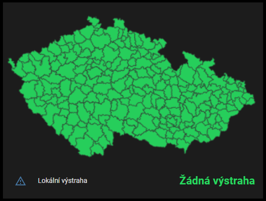
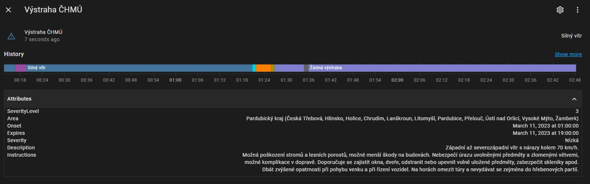

# CHMI-Alerts
CHMI alert(s) live integration for Home Assistant

# Description
Integrates the most important alert (alert with highest severity) into HA as entity with describing attributes with optional graphical map view.

# How it works
The Python script downloads full XML alert list from CHMI and parses it (according to given CISORP) into JSON for HA CLI sensor.
The script can also download a map image to a PNG file specified via optional second optional command-line parameter.

# Installation
1. Copy content from repository directory **python_scripts** to **/config/python_scripts** in your HA instance.
2. Create HA command_line sensor (https://www.home-assistant.io/integrations/sensor.command_line/).
   - Example in **[configuration_example.yaml](configuration_example.yaml)**.
4. Edit the command line in sensor configuration `command: "python3 /config/python_scripts/chmi_alert.py 5309"` and change the *5309* (CISORP) parameter according to your location.
   - Find your location on: https://apl.czso.cz/iSMS/cisdet.jsp?kodcis=65
6. If you want to download a mini map image to a local PNG file for a picture card in next step, provide the target file path as a second optional command-line parameter:
   - `python3 /config/python_scripts/chmi_alert.py 5309 /config/www/chmi_alert_map.png`
     - that would be accessible via http://your_ha_address/local/chmi_alert_map.png
   - For more info about accessing files over HTTP(s) in HA: https://www.home-assistant.io/integrations/http/#hosting-files 
8. Add a card with sensor to your dashboard and optionally specify a PNG file map path in the picture card (you can use relative URL path like *"/local/chmi_alert_map.png"*) - example in **[card_example.yaml](card_example.yaml)**.
9. Restart HA and the new configured entity would show up (you can change the update interval by `scan_interval:` parameter).
